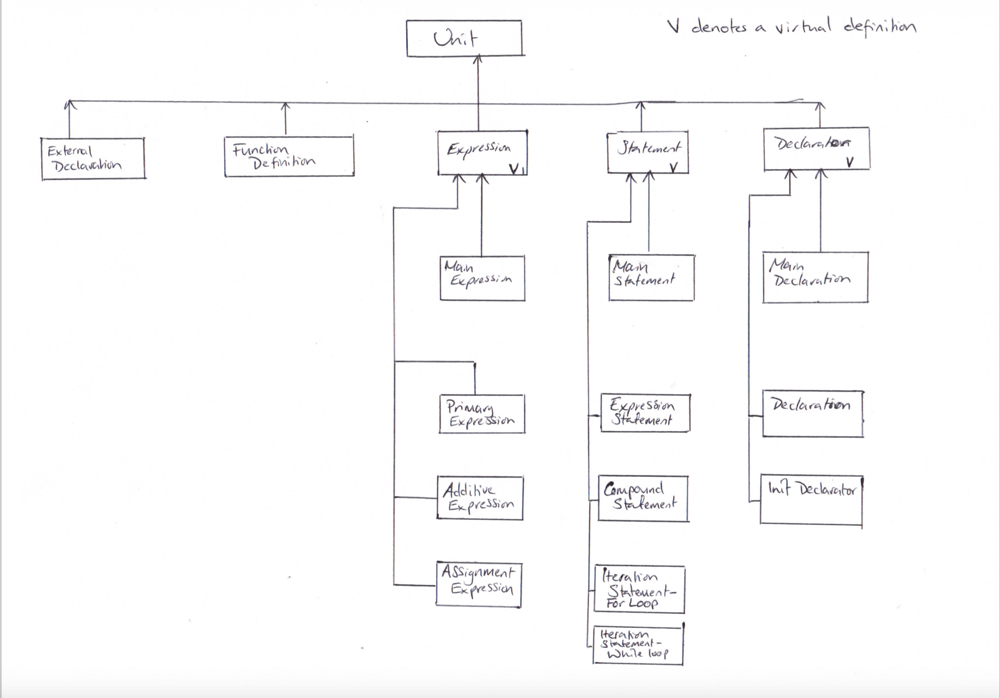

Documentation
=============

In total the documentation burden is (at most) 1000 words
plus one diagram. Assessment of the documentation is not relative
to compiler functionality, it just requires a description
of the compiler as-is, and a realistic assessment of the
compiler's strengths and weaknesses.

AST
===

Overview Diagram
----------------

_Add a diagram of your AST, which is designed to *usefully* communicate
the *important* properties of the AST._

- _Use whatever level of detail you feel is appropriate_.

- _You do not need to include every part of the AST, and you
  don't need to include every class_.

- _Zooming should not be necessary to understand it_.

The file should be called `my-ast.png`. The software used
to generate the png is up to you, or you can draw it by hand
and scan it if you wish (though beware the eventual file-size).

Description
-----------

_Describe the structure and organization of your AST in 200 words
or fewer_.

- _Feel free to refer to your diagram_.

- _Try to capture the most important properties_.

- _You can use code, but it is included in your budget_.

The structure of the AST closely matches that of the grammar and attempts to follow OOP principles of "is a, has a" inheritance. The root of the tree is a superclass named "Unit", of which everything lower down in the tree inherits from. The tree then splits into five subclasses, where ‘function_definition_unit’ and ‘external_definition_unit’ are non-virtual while ‘expression’, ‘statement’ and ‘declaration’ are virtual class constructors, as these have further child classes in order to link to relate to the grammar. A 'main' class of each type (expression, statement, declarator) provides the non-virtual implementation as well as the definition for the lists of those types. While not shown in the diagram, classes are either specialized or general depending on their implementation, for instance a while loop has different member functions to that of a for loop. Due to this close coupling to the grammar, the AST relies on the basic grammatical constructs being built up into more complex structures and so when the MIPS assembly is generated, the amount of code being emitted decreases when moving inwards from the leaves due to the lower levels handling most of it.

Strengths
---------

_Give two strengths or capabilities of your AST, using 50 words or less for each one_.

### Strength 1

* One strength of the AST is the way in which the higher levels delegate code-generation to the lower levels meaning that the ease of implementing structure like loops was increased due to their basic components already having been implemented, and tested.

### Strength 2

* Another strength of the AST is that it makes use of lists of pointers of the parent class types so that multiple statements can be accessed through the inheritance hierarchy.

Limitations
-----------

_Give two limitations of your AST, using 50 words or less for each one_.

### Limitation 1

* The close mapping to the grammar (taken from the C89/C90 specification) meant that some parts of the AST where over complicated at it was hard to know which children followed from which parents.

### Limitation 2

* In some cases there was a lack of specialization, which led to bloated, duplicated code that had to be repeated across the AST and became *very* unwieldy at times.

Variable binding
================

General approach
----------------

_Describe your overall approach to mapping variable, parameters, etc.
into registers or memory locations at execution time, using 200 words
or less_.

- _how did you manage registers?_
- _did you use the stack?_
- _is there a function or API for managing and looking up bindings?_

Variable bindings where implemented using a context object that was passed by reference and stored a map of the variable name as the key and then an allocations object which contains the register it is currently stored in, its memory location, the value being assigned as well as the current scope of that variable. Registers were managed using a private stack for each register class contained within the context object, and allocated and returned using an API. When registers were allocated, they were pushed off the stack and when finished, returned to the stack. For the most part, bindings were added to and accessed from the map contained within the context via a function defined in the context class, but due to an error from g++, the map had to be made public to access it in some instances. A map of global variables and functions was also maintained to that global variables could be manipulated in the same way as local variables and so that functions could be part of an assignment statement.

Strengths
---------

_Give two strengths or capabilities of your binding approach, using 50 words or less for each one_.

### Strength 1

A major strength of the approach used for the bindings is the way in which the registers are managed. The stack-based method ensures that registers are only used that are available, and not inadvertently over-written.

### Strength 2

Another strength of the binding is that checks were carried out to see if the variable was local or global. Should there be two variables of the same name in the local and global scope, the local variable took precedence.

Limitations
-----------

_Give two limitations of your binding approach, using 50 words or less for each one_.

### Limitation 1

The first limitation is that the bindings maps are all publicly accessible and not fully encapsulated. This has the potential to lead to inadvertent access or placing the wrong type of variable in the wrong map.

### Limitation 2

Another limitation is that there is a great number of checks that are performed in order to ensure that the binding is carried out correctly, which led to some confusion when debugging code as it was difficult to diagnose which flags were and were not being set properly.

Reflection
==========

Strengths
---------

_What two aspects of your compiler do you think work well (beyond
those identified in the AST and binding parts)?_

### Strength 1

One strength of the compiler as whole is that it is able to handle nested returns very well due to the way labels for jumps are stored, accessed and checked against. This functionality is also fully contained within the return class 'code-generation' method, making for neat code.

### Strength 2

The way that scoping is performed is simple, effective and fully encapsulated within the context class as the counter is private variable. There is an API to access and update the scope information, which is used every time a new scope is entered.

Scope for Improvement
---------------------

_What parts of your compiler do you think could be improved?_

- _This is not looking for things like "It should support more C constructs". What
  would you need to do or change in order to support those things?_

### Improvement 1

The first improvement is to implement function calls with parameters, as those without are only supported. The change required is to update the grammar to allow for parameters, then write the 'codegen' method for the non-terminal. This would be straightforward as the rest of the framework is in place.

### Improvement 2

The second is to write helper functions that build up the code output rather than to have it all contained within the header files as well as to reduce the amount of output code that is mostly the same, apart from one or two aspects such as operand names.

Functionality (not assessed)
============================

Which of these features does your compiler support (insert
an `x` to check a box):

1 - [x] Local variables
2 - [x] Integer arithmetic
3 - [x] While
4 - [x] IfElse
5 - [x] For
6 - [x] Function calls
7 - [ ] Arrays
8 - [ ] Pointers
9 - [ ] Strings
10 - [ ] Structures
11 - [ ] Floating-point

Note that all features will be tested, regardless of what
appears here. This is documentation of what you expect to work,
versus what doesn't work.

Feedback (not assessed)
=======================

_What aspects of your compiler would you like feedback on.
Be specific, as "what could I have done differently" is
too general to answer._

### Feedback 1

Rather than to search through the maps when doing an assignment, is there a better way that saves on somewhat duplicated code?

### Feedback 2

How can I improve my frame space allocation?
